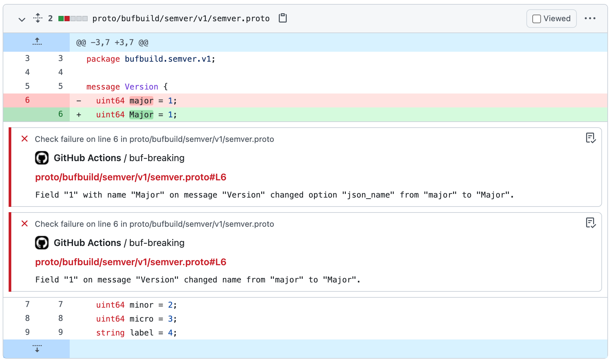

# The `buf-breaking` Action

This [Action][actions] enables you to perform [breaking change detection][breaking] with
[Buf] in your GitHub Actions pipelines. If it detects breaking changes in a pull request, it
automatically creates inline comments where the change occurs.



Breaking change detection is essential to ensuring backwards compatibility in Protobuf APIs.

## Usage

Here's an example usage of The `buf-breaking` Action:

```yaml
on: pull_request
jobs:
  validate-protos:
    steps:
      - uses: actions/checkout@v2               # Run `git checkout`
      - uses: bufbuild/buf-setup-action@v0.5.0  # Install the `buf` CLI
      - uses: bufbuild/buf-breaking-action@v1   # Perform breaking change detection against `main`
        with:
          against: 'https://github.com/acme/weather.git#branch=main'
```

With this configuration, the Action detects breaking changes between the Protobuf sources in the
current branch against the `main` branch of the repository.

For the `buf-breaking` Action to run, the `buf` CLI needs to be installed in the GitHub Actions
Runner first. We recommend using the [`buf-setup`][buf-setup] Action to install it (as in the
example above).

The `buf-breaking` action is also commonly used alongside other `buf` Actions, such as
[`buf-lint`][buf-lint], which performs [lints][lint] Protobuf sources, and [`buf-push`][buf-push],
which pushes Protobuf sources to the  [Buf Schema Registry][bsr] (BSR). See [example
configurations](#example-configurations) for more.

## Configuration

Parameter | Description | Required | Default
:---------|:------------|:---------|:-------
`input` | The [Input] path | | `.`
`against` | The reference to check compatibility against | ✅ |
`buf_input_https_username` | The username for the repository to check compatibility against. | | [`${{github.actor}}`][context]
`buf_input_https_password` | The password for the repository to check compatibility against. | | [`${{github.token}}`][context]
`buf_token` | The Buf [authentication token][token] used for private [Inputs][input]. | |

These parameters are derived from [`action.yml`](./action.yml).

> **Note**: For the `buf-breaking-action` to detect changes successfully, both the `input` and the
* `against` must be buildable by the `buf` CLI. You can verify this locally using the
> [`buf build`][buf-build] command on both Inputs.

### Example configurations

Example | Config file
:-------|:-----------
Simple breaking change detection | [`examples/simple-change-detection.yaml`](./examples/simple-change-detection.yaml)
Detect breaking changes, then push | [`examples/detect-and-push.yaml`](./examples/detect-and-push.yaml)
Detect breaking changes in a sub-directory | [`examples/detect-in-directory.yaml`](./examples/detect-in-directory.yaml)

## Common tasks

### Run on push

A common Buf workflow in GitHub Actions is to push the Protobuf sources in the current branch to the
[Buf Schema Registry][bsr] if no breaking changes are detected against the previous commit (where
`ref` is `HEAD~1`).

```yaml
# Apply to all pushes to `main`
on:
  push:
    branches:
      - main
jobs:
  validate-protos:
    steps:
      - uses: actions/checkout@v2              # Run `git checkout`
      - uses: bufbuild/buf-setup-action@v0.5.0 # Install the `buf` CLI
      - uses: bufbuild/buf-breaking-action@v1  # Perform breaking change detection against the last commit
        with:
          against: 'https://github.com/acme/weather.git#branch=main,ref=HEAD~1'
```

### Run against Input in sub-directory

Some repositories are structured in such a way that their [`buf.yaml`][buf-yaml] is defined in a
sub-directory alongside their Protobuf sources, such as a `proto/` directory. Here's an example:

```sh
$ tree
.
└── proto
    ├── acme
    │   └── weather
    │       └── v1
    │           └── weather.proto
    └── buf.yaml
```

In that case, you can target the `proto` sub-directory in the by setting

* `input` to `proto`, and
* `subdir` to `proto` in the `against` reference.

```yaml
steps:
  - uses: actions/checkout@v2
  - uses: bufbuild/buf-setup-action@v0.5.0
  - uses: bufbuild/buf-breaking-action@v1
    with:
      input: 'proto'
      against: 'https://github.com/acme/weather.git#branch=main,ref=HEAD~1,subdir=proto'
```

[actions]: https://docs.github.com/actions
[breaking]: https:/docs.buf.build/breaking
[bsr]: https://docs.buf.build/bsr
[buf]: https://buf.build
[buf-build]: https://docs.buf.build/build/usage
[buf-lint]: https://github.com/marketplace/actions/buf-lint
[buf-push]: https://github.com/marketplace/actions/buf-push
[buf-setup]: https://github.com/marketplace/actions/buf-setup
[buf-yaml]: https://docs.buf.build/configuration/v1/buf-yaml
[context]: https://docs.github.com/en/actions/learn-github-actions/contexts#github-context
[input]: https://docs.buf.build/reference/inputs
[lint]: https://docs.buf.build/lint/usage
[token]: https://docs.buf.build/bsr/authentication#create-an-api-token
